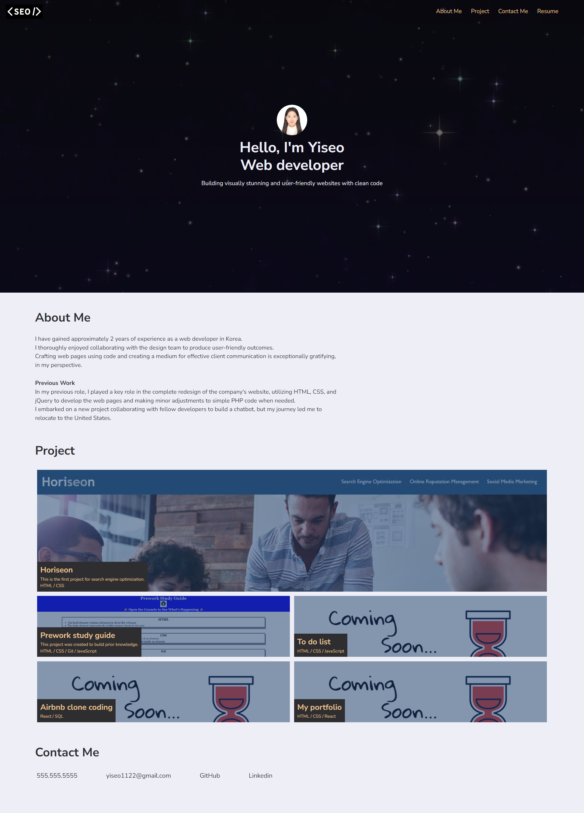

# portfolio-challenge-2

## Description
This project was created to build a personal portfolio website.
It showcases my skills and experience as a web developer, highlighting the projects
I have completed and providing contact information for further communication.

## Live link
[**https://yiseo.github.io/portfolio-challenge-2/**](https://yiseo.github.io/portfolio-challenge-2/)

## Screenshot

## Installation
N/A

## Technologies Used
- HTML
- CSS
- Git
- Github
